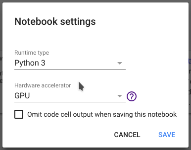

# Joining phenomenal deep learning course fast.ai using free Google Colaboratory setup.

My colleague Ilia Lebedev @melevir at twitter recommended me a cool deep learning course at [http://course.fast.ai](http://course.fast.ai/).

<!--more-->

Much appreciation to *Jeremy* and *Rachel* who gave us this opportunity to learn. They position themself as a course for software developers, not data scientists. This course is of January 2018, is the second version.

Listen that the course said for itself.

> ## YOU WILL LEARN HOW TO:
>
> * Set up your own GPU server in the cloud
> * Use the fastai and Pytorch libraries in [python](https://www.python.org/) to train and run deep learning models
> * Build, debug, and visualize a state of the art convolutional neural network (CNN) for recognizing images
> * Build state of the art recommendation systems using neural-network based collaborative filtering
> * Build state of the art time series and structured data models using categorical embeddings
> * Get great results even from small datasets, by using transfer learning
> * Understand the components of a neural network, including activation functions, dense and convolutional layers, and optimizers
> * Build, debug, and visualize a recurrent neural network (RNN) for natural language processing (NLP), including developing a sentiment classifier which beat all previous academic benchmarks.
> * Recognize and deal with over-fitting, by using data augmentation, dropout, batch normalization, and similar techniques

## Back to a setup for fast.ai course using free Google Colaboratory.

In this post, I will show how to use organize setup of [Google Colaboratory](https://colab.research.google.com/) for the fast.ai deep learning course. You should repeat this simple steps every time you connect to a new GPU.

In order to train a neural network, we will most certainly need Graphics Processing Unit (GPU) – and not everyone have a fast one. Without a decent GPU a singe step will last for hours instead of minutes. Sign-up to [Google Colaboratory](https://colab.research.google.com/) to get a hosted Jupyter notebook environment connected with a **free** Tesla K80 GPU.

You can use GPU as a backend free for 12 hours at a time. That is very good news for us!

## The steps to repeat every time you connect to a new GPU.

### Setup step 0: Select Free GPU

It is so simple to alter default hardware (CPU to GPU or vice versa); just follow **Edit > Notebook settings** or **Runtime>Change runtime type** and **select GPU** as **Hardware accelerator**.




### Setup step 1: install libraries for fast.ai course.

Enter this code in a new code block on top of a notebook:

```python
# Install torch compatible with fastai
from os import path
from wheel.pep425tags import get_abbr_impl, get_impl_ver, get_abi_tag
platform = '{}{}-{}'.format(get_abbr_impl(), get_impl_ver(), get_abi_tag())
accelerator = 'cu80' if path.exists('/opt/bin/nvidia-smi') else 'cpu'
!pip install -q http://download.pytorch.org/whl/{accelerator}/torch-0.3.1-{platform}-linux_x86_64.whl fastai torchvision
```

This will take a while.

### Setup step 2: model weights download.

```python
# Model weights for other network architectures (e.g. resnext50):
!wget -q http://files.fast.ai/models/weights.tgz && tar -xzf weights.tgz -C /usr/local/lib/python3.6/dist-packages/fastai
```

The step 2 will take a while too, need to download and unpack 1.1 Gb.

### Setup step 3: dataset download.

For lesson 1, 2, 3 you need dogs $ cats dataset. This code does it. The dataset dogs & cats is available at http://files.fast.ai/data/dogscats.zip.

```python
!mkdir -p data
!wget -q http://files.fast.ai/data/dogscats.zip
!unzip -q dogscats.zip -d data/
```

Some lessons as 2nd use Kaggle datasets, but it is a theme for another article.

Summary of all my setup steps you can copy from my Github Gist [Fast.ai install script.py](https://gist.github.com/denis-trofimov/77f8b6418b9ef4b45adca7ed587462d2).

I will try to keep it updated as long as I have interest in fast.ai and Google Colaboratory.