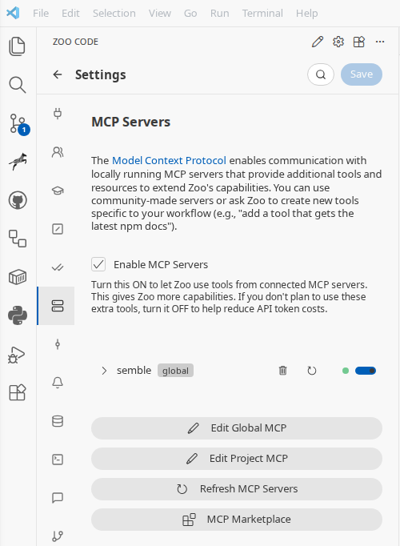

## Introduction

In modern development ecosystems, more and more attention is paid to automation and integration of various tools. One of the key players in this area is **Semble** — a code search library designed specifically for working with agents and simplifying their interaction with the code base.

## What is Semble?

Semble provides a powerful and extensible mechanism for searching through code, allowing agents to quickly find the necessary fragments, functions, classes, and dependencies. Thanks to support for many programming languages and the ability to create custom indices, Semble becomes a universal solution for any project.

### Installation

To install Semble, follow the official instructions:

- [Install Semble](https://github.com/MinishLab/semble/blob/main/docs/installation.md)

## Integration with Zoo Code

Zoo Code is a platform that allows you to create and manage agents that can perform various tasks in development. To ensure tight integration with Semble, you need to configure MCP servers.

### Setting up MCP servers in Zoo Code

To connect Semble to Zoo Code, open the MCP settings file and add the `semble` server to the `mcpServers` object. A detailed instruction on editing MCP files can be found in the Zoo Code documentation (link).



1. Open Zoo Code and go to MCP settings.
2. Find the `mcp_settings.json` file.
3. Add a new `semble` server to the `mcpServers` object with the command `uvx` and arguments `--from`, `semble[mcp]`, `semble`.
4. Set `type: stdio`, `disabled: false`, `alwaysAllow: []` and `timeout: 15`.
5. Save the file and restart Zoo Code or reload the extension.

Below is an example configuration of the `semble` MCP server in the `mcp_settings.json` file:

```json
{
  "mcpServers": {
    "semble": {
      "command": "uvx",
      "args": [
        "--from",
        "semble[mcp]",
        "semble"
      ],
      "type": "stdio",
      "disabled": false,
      "alwaysAllow": [],
      "timeout": 15
    }
  }
}
```

This configuration indicates that the server will be launched via `uvx` with the `semble[mcp]` package and will use standard input/output for communication with Zoo Code. The `timeout` parameter of 15 seconds ensures that requests do not hang indefinitely.

After this, Zoo Code agents will be able to access Semble through MCP and instantly retrieve the necessary code fragments.

## Advantages of Using Semble in Zoo Code

- **Instant search** — agents can instantly find the needed code, saving time.
- **Context‑aware search** — the ability to filter results by projects, files, and types.
- **Extensibility** — new languages and frameworks can be added via plugins.

## Additional Advantages of Semble

Semble offers the following advantages:

- **Resource saving** — it uses ~98% fewer tokens than grep+read, making it more efficient for large projects.
- **High performance** — indexing and searching the entire code base takes less than a second, with ~200× faster indexing and ~10× faster queries compared to code transformers, while maintaining 99% retrieval quality (see benchmarks).
- **Local execution** — everything runs on CPU without the need for API keys, GPUs, or external services.
- **Flexible integration** — it can be used as an MCP server, a CLI tool via AGENTS.md, or a separate sub‑agent, providing access to any repository for any code agents (Claude Code, Cursor, Codex, OpenCode, etc.).

## Conclusion

The combination of Semble and Zoo Code opens up new possibilities for automating development, allowing agents to work with code bases more efficiently. Proper configuration of MCP servers ensures reliable and fast interaction, and the Semble library provides flexibility and power in code search.
