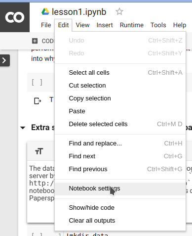

# Joining phenomenal deep learning course fast.ai using free Google Colaboratory setup.

My colleague Ilia Lebedev @melevir at twitter recommended me a cool deep learning course at [http://course.fast.ai.][1]

<!--more-->

<em class="markup--em markup--p-em">Much appreciation to </em><a class="markup--anchor markup--p-anchor" href="https://twitter.com/jeremyphoward" target="_blank" rel="noopener nofollow nofollow noopener nofollow noopener" data-href="https://twitter.com/jeremyphoward"><em class="markup--em markup--p-em">Jeremy</em></a><em class="markup--em markup--p-em"> and </em><a class="markup--anchor markup--p-anchor" href="https://twitter.com/math_rachel" target="_blank" rel="noopener nofollow nofollow noopener nofollow noopener" data-href="https://twitter.com/math_rachel"><em class="markup--em markup--p-em">Rachel</em></a><em class="markup--em markup--p-em"> who gave us this opportunity to learn. </em>They position themself as a course for software developers, not data scientists. This course is of January 2018, is the second version.

Listen that the course said for itself.

> ## YOU WILL LEARN HOW TO:
> 
>   * <a class="ab-item" href="https://denis-trofimov.github.io/wp-admin/post-new.php" aria-haspopup="true"><span class="ab-label">New</span></a><span style="color: #444444;"><span style="font-family: Raleway, Helvetica Neue, Helvetica, Roboto, Arial, sans-serif;"><span style="font-size: small;"> Set up your own GPU server in the cloud</span></span></span>
>   * <span style="color: #444444;"><span style="font-family: Raleway, Helvetica Neue, Helvetica, Roboto, Arial, sans-serif;"><span style="font-size: small;">Use the fastai and Pytorch libraries in </span></span></span>[<span style="color: #dba901;"><span style="font-family: Raleway, Helvetica Neue, Helvetica, Roboto, Arial, sans-serif;"><span style="font-size: small;">python</span></span></span>][2]<span style="color: #444444;"><span style="font-family: Raleway, Helvetica Neue, Helvetica, Roboto, Arial, sans-serif;"><span style="font-size: small;"> to train and run deep learning models</span></span></span>
>   * <span style="color: #444444;"><span style="font-family: Raleway, Helvetica Neue, Helvetica, Roboto, Arial, sans-serif;"><span style="font-size: small;">Build, debug, and visualize a state of the art convolutional neural network (CNN) for recognizing images</span></span></span>
>   * <span style="color: #444444;"><span style="font-family: Raleway, Helvetica Neue, Helvetica, Roboto, Arial, sans-serif;"><span style="font-size: small;">Build state of the art recommendation systems using neural-network based collaborative filtering</span></span></span>
>   * <span style="color: #444444;"><span style="font-family: Raleway, Helvetica Neue, Helvetica, Roboto, Arial, sans-serif;"><span style="font-size: small;">Build state of the art time series and structured data models using categorical embeddings</span></span></span>
>   * <span style="color: #444444;"><span style="font-family: Raleway, Helvetica Neue, Helvetica, Roboto, Arial, sans-serif;"><span style="font-size: small;">Get great results even from small datasets, by using transfer learning</span></span></span>
>   * <span style="color: #444444;"><span style="font-family: Raleway, Helvetica Neue, Helvetica, Roboto, Arial, sans-serif;"><span style="font-size: small;">Understand the components of a neural network, including activation functions, dense and convolutional layers, and optimizers</span></span></span>
>   * <span style="color: #444444;"><span style="font-family: Raleway, Helvetica Neue, Helvetica, Roboto, Arial, sans-serif;"><span style="font-size: small;">Build, debug, and visualize a recurrent neural network (RNN) for natural language processing (NLP), including developing a sentiment classifier which beat all previous academic benchmarks.</span></span></span>
>   * <span style="color: #444444;"><span style="font-family: Raleway, Helvetica Neue, Helvetica, Roboto, Arial, sans-serif;"><span style="font-size: small;">Recognize and deal with over-fitting, by using data augmentation, dropout, batch normalization, and similar techniques</span></span></span>

## Back to a setup for fast.ai course using free Google Colaboratory.

In this post, I will show how to use organize setup of <a class="markup--anchor markup--p-anchor" href="https://colab.research.google.com/" target="_blank" rel="nofollow noopener" data-href="https://colab.research.google.com/">Google Colaboratory</a> for the fast.ai deep learning course. You should repeat this simple steps every time you connect to a new GPU.

In order to train a neural network, we will most certainly need Graphics Processing Unit (GPU)  &#8211; and not everyone have a fast one. Without a decent GPU a singe step will last for hours instead of minutes. Sign-up to <a class="markup--anchor markup--p-anchor" href="https://colab.research.google.com/" target="_blank" rel="nofollow noopener" data-href="https://colab.research.google.com/">Google Colaboratory</a> to get a hosted Jupyter notebook environment connected<strong class="markup--strong markup--p-strong"> </strong>with a **free** Tesla K80 GPU.

You can use GPU as a backend free for 12 hours at a time. That is very good news for us!<figure id="6aed" class="graf graf--figure graf-after--p"> 

## The steps to repeat every time you connect to a new GPU. {.aspectRatioPlaceholder.is-locked}

### Setup step 0: Select Free GPU

<p id="7ecb" class="graf graf--p graf-after--h3">
  It is so simple to alter default hardware <strong class="markup--strong markup--p-strong">(CPU to GPU or vice versa)</strong>; just follow <strong class="markup--strong markup--p-strong">Edit > Notebook settings</strong> or <strong class="markup--strong markup--p-strong">Runtime>Change runtime type </strong>and <strong class="markup--strong markup--p-strong">select GPU </strong>as <strong class="markup--strong markup--p-strong">Hardware accelerator</strong>.
</p>




### Setup step 1: install libraries for fast.ai course.

Enter this code in a new code block on top of a notebook:

```python
# Install torch compatible with fastai
from os import path
from wheel.pep425tags import get_abbr_impl, get_impl_ver, get_abi_tag
platform = '{}{}-{}'.format(get_abbr_impl(), get_impl_ver(), get_abi_tag())
accelerator = 'cu80' if path.exists('/opt/bin/nvidia-smi') else 'cpu'
!pip install -q http://download.pytorch.org/whl/{accelerator}/torch-0.3.1-{platform}-linux_x86_64.whl fastai torchvision
```

This will take a while.

### Setup step 2: model weights download.

```python
# Model weights for other network architectures (e.g. resnext50):
!wget -q http://files.fast.ai/models/weights.tgz && tar -xzf weights.tgz -C /usr/local/lib/python3.6/dist-packages/fastai
```

The step 2 will take a while too, need to download and unpack 1.1 Gb.

### Setup step 3: dataset download.

For lesson 1, 2, 3 you need dogs $ cats dataset. This code does it. The dataset dogs & cats is available at http://files.fast.ai/data/dogscats.zip.

```python
!mkdir -p data
!wget -q http://files.fast.ai/data/dogscats.zip
!unzip -q dogscats.zip -d data/
```

Some lessons as 2nd use Kaggle datasets, but it is a theme for another article.

Summary of all my setup steps you can copy from my Github Gist <strong class="gist-header-title css-truncate-target"><a href="https://gist.github.com/denis-trofimov/77f8b6418b9ef4b45adca7ed587462d2">Fast.ai install script.py.</a></strong>

I will try to keep it updated as long as I have interest in fast.ai and Google Colaboratory.

 [1]: http://course.fast.ai/
 [2]: https://www.python.org/