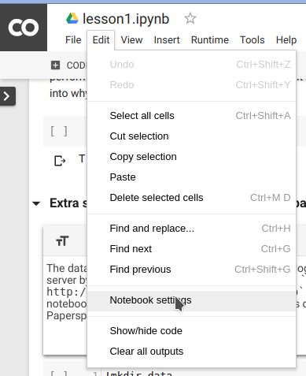

# Присоединяйтесь к феноменальному курсу глубокого обучения fast.ai, используя бесплатную настройку Google Colaboratory.

Мой коллега Илья Лебедев @melevir в твиттере порекомендовал мне классный курс глубокого обучения на [http://course.fast.ai](http://course.fast.ai/).

<!--подробнее-->

Огромная признательность *Джереми* и *Рэйчел*, которые дали нам возможность учиться. Они позиционируют себя как курс для разработчиков программного обеспечения, а не специалистов по обработке данных. Этот курс от января 2018 года, является второй версией.

Послушайте, курс сказал сам за себя.

> ## ВЫ УЗНАЕТЕ, КАК:
>
> * Настройте собственный графический сервер в облаке
> * Используйте библиотеки fastai и Pytorch в [python](https://www.python.org/) для обучения и запуска моделей глубокого обучения.
> * Создайте, отладьте и визуализируйте современную сверточную нейронную сеть (CNN) для распознавания изображений.
> * Создавайте современные системы рекомендаций, используя совместную фильтрацию на основе нейронных сетей.
> * Создавайте современные временные ряды и модели структурированных данных с использованием категориальных вложений.
> * Получайте отличные результаты даже при работе с небольшими наборами данных, используя трансферное обучение.
> * Понимать компоненты нейронной сети, включая функции активации, плотные и сверточные слои, а также оптимизаторы.
> * Создайте, отладьте и визуализируйте рекуррентную нейронную сеть (RNN) для обработки естественного языка (NLP), включая разработку классификатора настроений, который превзойдет все предыдущие академические тесты.
> * Распознавайте и боритесь с чрезмерной подгонкой, используя увеличение данных, исключение, пакетную нормализацию и аналогичные методы.

## Вернёмся к настройке курса fast.ai с помощью бесплатной Google Colaboratory.

В этом посте я покажу, как использовать настройку организации [Google Colaboratory](https://colab.research.google.com/) для курса глубокого обучения fast.ai. Вам следует повторять эти простые шаги каждый раз при подключении к новому графическому процессору.

Для обучения нейронной сети нам наверняка понадобится графический процессор (GPU), а быстрый он есть не у всех. Без приличного графического процессора один шаг будет длиться часами, а не минутами. Зарегистрируйтесь в [Google Colaboratory](https://colab.research.google.com/), чтобы получить размещенную среду ноутбуков Jupyter, подключенную к **бесплатному** графическому процессору Tesla K80.

Вы можете бесплатно использовать графический процессор в качестве серверной части в течение 12 часов за раз. Для нас это очень хорошая новость!

## Действия, которые необходимо повторять каждый раз при подключении к новому графическому процессору.

### Шаг настройки 0: выберите бесплатный графический процессор

Изменить оборудование по умолчанию (CPU на GPU или наоборот) очень просто; просто выберите **Редактировать > Настройки ноутбука** или **Время выполнения>Изменить тип среды выполнения** и **выберите графический процессор** в качестве **Аппаратный ускоритель**.




### Шаг установки 1: установите библиотеки для курса fast.ai.

Введите этот код в новый блок кода в верхней части блокнота:

``` python
# Установите факел, совместимый с fastai
из пути импорта ОС
из Wheel.pep425tags импортируйте get_abbr_impl, get_impl_ver, get_abi_tag
платформа = '{}{}-{}'.format(get_abbr_impl(), get_impl_ver(), get_abi_tag())
Accelerator = 'cu80', если path.exists('/opt/bin/nvidia-smi') иначе 'процессор'
!pip install -q http://download.pytorch.org/whl/{accelerator}/torch-0.3.1-{platform}-linux_x86_64.whl fastai torchvision
```

Это займет некоторое время.

### Шаг настройки 2: загрузка весов моделей.

``` python
# Веса моделей для других сетевых архитектур (например, resnext50):
!wget -q http://files.fast.ai/models/weights.tgz && tar -xzf Weights.tgz -C /usr/local/lib/python3.6/dist-packages/fastai
```

Шаг 2 тоже займет некоторое время, нужно скачать и распаковать 1,1 Гб.

### Шаг настройки 3: загрузка набора данных.

Для уроков 1, 2, 3 вам понадобится набор данных о собаках и кошках. Этот код делает это. Набор данных о собаках и кошках доступен по адресу http://files.fast.ai/data/dogscats.zip.

``` python
!mkdir -p данные
!wget -q http://files.fast.ai/data/dogscats.zip
!unzip -q Dogscats.zip -d данные/
```

В некоторых уроках, в качестве вторых, используются наборы данных Kaggle, но это тема для другой статьи.

Краткое описание всех моих шагов по настройке вы можете скопировать из моего Github Gist [Fast.ai install script.py] (https://gist.github.com/denis-trofimov/77f8b6418b9ef4b45adca7ed587462d2).

Я постараюсь держать его в курсе, пока меня интересуют fast.ai и Google Colaboratory.